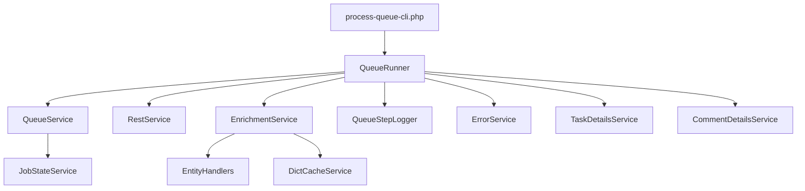

 # TASK-017: Рефакторинг process-queue.php на подслужбы
 
 **Дата создания:** 2026-01-23 18:53 (UTC+03:00, Брест)  
 **Статус:** Новая  
 **Приоритет:** Средний  
 **Исполнитель:** Bitrix24 Программист
 
 ## Описание
 Разделить текущий файл `outgoing-webhook/tools/process-queue.php` на набор
 подслужб/классов, чтобы изолировать ответственность (очередь, REST‑обогащение,
 словари, обработка ошибок, логирование) и упростить дальнейшую поддержку.
 
 ## Контекст
 Сейчас логика обработки очереди собрана в одном файле и включает:
 - разбор задания,
 - REST‑обогащение,
 - работу со справочниками,
 - перевод между состояниями очереди,
 - обработку ошибок и ретраев.
 
 Это усложняет чтение и развитие. Требуется разнести функции на подслужбы,
 сохранив текущее поведение и формат логов/файлов.
 
## Цели и границы
### Цели
- Повысить читаемость и сопровождаемость модуля.
- Ускорить развитие (добавление новых сценариев/сущностей).
- Улучшить прозрачность выполнения через метрики/шаги.

### Границы
- Существующие форматы `raw.json`, `enriched.json`, `event.log`,
  `task-details.log`, `comment-details.log` не менять.
- Допустимо добавление новых служебных файлов логов, но без изменения старых.
- `outgoing-webhook/index.php` остаётся синхронным для деталей задач/комментариев.
- Переход на CLI‑обёртку обязателен (cron/CLI).

 ## Модули и компоненты
 - `outgoing-webhook/tools/process-queue.php` — точка входа (останется тонкой).
- `outgoing-webhook/tools/process-queue-cli.php` — CLI‑обёртка для cron.
- `outgoing-webhook/services/Config/ConfigService.php` — централизованная конфигурация.
- `outgoing-webhook/services/Queue/QueueService.php` — работа с очередью и файлами.
- `outgoing-webhook/services/Queue/JobStateService.php` — перевод pending/processing/done/failed.
- `outgoing-webhook/services/Enrichment/EnrichmentService.php` — обогащение сущностей.
- `outgoing-webhook/services/Enrichment/EntityHandlers/*.php` — обработчики сущностей.
- `outgoing-webhook/services/Dicts/DictCacheService.php` — кэш справочников.
- `outgoing-webhook/services/Rest/RestService.php` — REST‑вызовы с ретраями/лимитами.
- `outgoing-webhook/services/Logging/ErrorService.php` — унифицированные ошибки.
- `outgoing-webhook/services/Logging/QueueStepLogger.php` — шаги started/finished.
- `outgoing-webhook/services/Task/TaskDetailsService.php` — детали задач.
- `outgoing-webhook/services/Task/CommentDetailsService.php` — детали комментариев.
 - `outgoing-webhook/bootstrap.php` — общие функции (без бизнес‑логики очереди).
 
 ## Зависимости
 - Используются функции из `outgoing-webhook/bootstrap.php`.
 - REST‑клиент: `app/Services/Bitrix24Client.php` и `app/crest.php`.
 - Форматы логов/файлов описаны в:
   - `DOCS/TASKS/TASK-014-06-payload-schemas.md`
   - `DOCS/LOGS-Managment/outgoing-webhook-logs.md`
 
## Детальная структура и контракты
### ConfigService
- Источники: env + `outgoing-webhook/config.local.php`.
- Методы: `get(string $key, ?string $default = null): ?string`, `getArray(string $key): array`.

### RestService
- Единая точка вызовов Bitrix24 REST.
- Методы: `call(string $method, array $params = []): array`.
- Ретраи и лимиты на уровне сервиса (настройки через ConfigService).

### QueueService / JobStateService
- Чтение очереди, блокировки, перемещения файлов, подсчёт.
- Методы:
  - `nextPending(): ?QueueJob`
  - `markProcessing(QueueJob $job): QueueJob`
  - `markDone(QueueJob $job): void`
  - `markFailed(QueueJob $job, string $reason, ?string $method = null): void`

### EnrichmentService + EntityHandlers
- `EnrichmentService::buildEnriched(QueueJob $job): array`
- Обработчики по типам сущностей: `DealHandler`, `LeadHandler`, `TaskHandler`, `SmartProcessHandler`, `UserHandler`, `ProjectHandler`, `CrmUserFieldHandler`.
- Каждый handler отвечает за метод обогащения и доп. словари.

### DictCacheService
- Кэш справочников в `outgoing-webhook/logs/dicts/`.
- TTL/пути без изменения текущих значений.

### Logging
- `ErrorService` пишет ошибки в `logs/errors/`.
- `QueueStepLogger` пишет шаги `started/finished` в отдельный файл
  (например, `logs/queue-steps.log`) без изменения существующих логов.

### Task/Comment Details
- Отдельные сервисы для `task-details.log` и `comment-details.log`.
- Используют текущий формат строк логов (без изменений).

## Диаграмма потока (целевое состояние)

## Backward compatibility (что сохраняем)
### Внешние входы/запуски
- Сохраняется файл `outgoing-webhook/tools/process-queue.php` как точка входа,
  но он становится тонкой обёрткой над новым Runner.
- Добавляется `outgoing-webhook/tools/process-queue-cli.php` (рекомендуемая точка запуска для cron).

### Поведение и контракты файлов
- Форматы `raw.json`, `enriched.json`, `event.log`, `task-details.log`, `comment-details.log`
  остаются без изменения.
- Структура очереди `queue/pending|processing|done|failed` сохраняется.
- Ошибки пишутся в те же каталоги `logs/errors/` с прежними ключами.

### Совместимость для скриптов
- Любые внешние скрипты, которые делают `require process-queue.php`,
  должны продолжить работать без изменений.
- Названия глобальных функций/констант, используемых снаружи,
  не удаляются без shim‑обёртки.

## Ступенчатые подзадачи (детализация)
1. Зафиксировать список функций `process-queue.php` и их соответствие новым сервисам.
2. Создать доменную структуру `outgoing-webhook/services/` (Config/Queue/Enrichment/Rest/Logging/Task).
3. Реализовать `ConfigService` и внедрить его в новые сервисы.
4. Реализовать `RestService` с политикой ретраев (конфигурируемо).
5. Перенести логику очереди в `QueueService` и `JobStateService`.
6. Реализовать `EnrichmentService` + handlers по сущностям.
7. Перенести dict‑логику в `DictCacheService` без изменения TTL/путей.
8. Вынести логирование ошибок в `ErrorService`.
9. Добавить `QueueStepLogger` (started/finished) в отдельный файл логов.
10. Вынести формирование деталей задач/комментариев в сервисы.
11. Оставить в `process-queue.php` только orchestration.
12. Создать CLI‑обёртку `process-queue-cli.php` для cron.
13. Обеспечить backward‑compatibility (старые импорты/вызовы не ломаются).
14. Обновить документацию `DOCS/OUTGOING-EVENTS/` под новую структуру.
15. Написать unit‑тесты для ключевых сервисов (Rest/Queue/Enrichment handlers).
 
 ## Технические требования
 - Язык: PHP 8.4.
 - Без изменения поведения модуля (только рефакторинг).
- Не менять формат JSON и строковых логов (добавление новых логов допустимо).
 - Не менять структуру каталогов очереди/логов.
 - Ошибки должны продолжать логироваться в прежние файлы.
- Разделение по доменам (Queue/Enrichment/Logging/Rest/Config).
- Переход на CLI‑обёртку для запуска процесса.
- Поддержка backward‑compatibility для внешних скриптов.
 
 ## Критерии приёмки
 - [ ] `process-queue.php` содержит только orchestration и минимум логики.
 - [ ] Логика разбита по подслужбам в `outgoing-webhook/services/`.
 - [ ] Поведение обработки очереди не изменилось.
 - [ ] Форматы `raw.json`, `enriched.json`, `event.log`, `task-details.log`, `comment-details.log` не изменены.
 - [ ] Ошибки пишутся в те же каталоги и с теми же ключами.
- [ ] Добавлен отдельный лог шагов очереди (`started/finished`).
- [ ] CLI‑обёртка работает через cron/CLI.
 - [ ] Новые файлы описаны в документации.
 
 ## Тестирование
 1. Взять 2–3 задания из `queue/pending/` и прогнать обработчик.
 2. Сравнить `enriched.json` и `event.log` до/после рефакторинга.
 3. Проверить корректное перемещение файлов между `pending/processing/done/failed`.
 4. Проверить записи в `logs/errors/` при намеренном REST‑ошибке.
5. Проверить запуск через CLI‑обёртку и корректный код возврата.
6. Прогнать unit‑тесты сервисов.
 
## Вопросы и ответы (контекст рефакторинга)
1. **Главная цель:** читаемость/поддерживаемость, производительность, подготовка к новым фичам.
2. **Структура очереди и логов:** допускаются изменения при необходимости (не жёстко фиксировано).
3. **Точка входа:** перейти на CLI‑обёртку (cron/CLI), а не оставлять только `process-queue.php`.
4. **Контракты:** нужны интерфейсы/контракты для сервисов.
5. **Зависимость от `bootstrap.php`:** сократить, часть функций перенести в сервисы.
6. **Конфигурация:** нужен отдельный ConfigService для outgoing‑webhook.
7. **Метрики:** добавить тайминги/метрики производительности на уровне сервисов.
8. **REST‑слой:** выделить отдельный RestService с политикой ретраев/лимитов.
9. **Ошибки:** унифицировать через ErrorService и общий формат.
10. **Логирование:** оставить только файловые логи (без новых каналов).
11. **Справочники:** оставить как есть (TTL/пути не менять).
12. **Тесты:** добавить unit‑тесты для новых сервисов.
13. **Версия PHP:** остаёмся на PHP 8.4.
14. **Обработчики сущностей:** разнести по типам сущностей (deal/lead/task и т.д.).
15. **Логи очереди:** добавить явные шаги started/finished.
16. **Детали задач/комментариев в index.php:** оставить синхронное получение.
17. **Документация:** обновить `DOCS/OUTGOING-EVENTS/` под новую структуру.
18. **Структура файлов:** разбиение по доменам (Queue/, Enrichment/, Logging/).
19. **Backward compatibility:** обеспечить совместимость для внешних скриптов.
20. **Миграция:** без этапа параллельного запуска, заменить сразу.

 ## История правок
 - 2026-01-23 18:53 (UTC+03:00, Брест): создана задача на рефакторинг.
- 2026-01-23 18:53 (UTC+03:00, Брест): добавлен раздел «Вопросы и ответы».
- 2026-01-23 19:02 (UTC+03:00, Брест): добавлена детальная структура и план работ.
- 2026-01-23 19:03 (UTC+03:00, Брест): добавлены диаграмма и блок backward‑compatibility.
